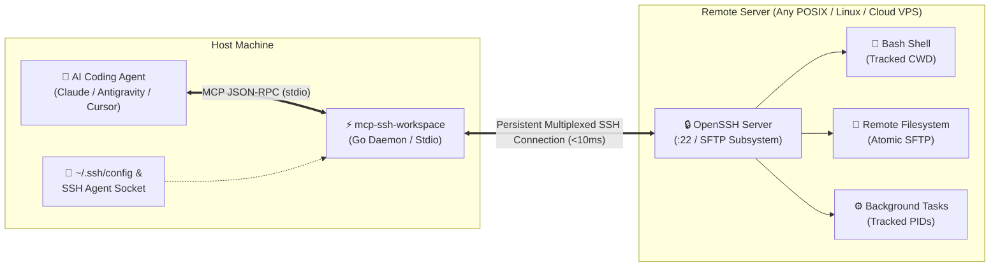

# 🚀 mcp-ssh-workspace

[](LICENSE)
[](https://go.dev)
[](flake.nix)
[](https://modelcontextprotocol.io)

An ultra-fast, native-like **SSH Workspace Model Context Protocol (MCP)** server engineered specifically for autonomous AI coding agents (Claude Desktop, Antigravity, Cursor, Cline, Zed, and custom agents).

Instead of treating remote servers as dumb, stateless `ssh exec` targets, **`mcp-ssh-workspace`** mirrors the **exact surgical primitives** that coding agents use on local machines: stateful bash execution, persistent directory tracking, token-safe line slicing, atomic chunk file editing, and background daemon task supervision—with **zero remote installation footprint**.

---

## 🏗️ Architecture



---

## ⚡ Why `mcp-ssh-workspace`?

| Feature | Generic SSH MCP Solutions | `mcp-ssh-workspace` |
| :--- | :--- | :--- |
| **Shell State (`cwd` & env)** | ❌ **Stateless:** Every call opens a fresh shell. `cd /app` is lost immediately. | ✅ **Stateful Session:** Tracks `cwd` automatically across all calls. |
| **Connection Overhead** | ❌ Re-authenticates and negotiates SSH handshake on every tool call (~1s). | ✅ **Multiplexed Pool:** Single persistent SSH/SFTP channel (<10ms latency). |
| **File Reading** | ❌ Dumps entire files with `cat` (overflows model context window). | ✅ **Token-Capped Slicing:** `StartLine`, `EndLine`, byte offsets, line numbering. |
| **File Editing** | ❌ Fragile `sed` or `cat << EOF` that fails on quotes, escapes, or binary files. | ✅ **Surgical Replacement:** Atomic chunk find-and-replace over binary SFTP. |
| **Long Commands / Daemons** | ❌ Blocks indefinitely or times out on build scripts and dev servers. | ✅ **Async Process Manager:** Auto-detaches to background task (`status`, `kill`, `stdin`). |
| **Remote Host Setup** | ❌ Requires Python, Node.js, or server-side agent daemons. | ✅ **Zero Footprint:** Requires only standard OpenSSH and SFTP subsystem. |
| **Host Connectivity** | ❌ Host is hardcoded at boot; crashes if server is offline. | ✅ **Dual Mode:** Static host via CLI/env **OR** dynamic `remote_connect` in-flight. |

---

## 🛠️ The 11 Agent Tools

### 1. Connection & Session Control
- **`remote_connect`**: Connect or switch to any SSH host dynamically at runtime. Automatically resolves host aliases, identity files, usernames, and ports from `~/.ssh/config`.
- **`remote_disconnect`**: Gracefully close active SSH sessions and SFTP subsystems.
- **`remote_session_info`**: Retrieve remote host OS (`/etc/os-release`, `uname`), hostname, current user, and persistent `cwd`.

### 2. Terminal & Process Management
- **`remote_run_command`**: Execute bash commands on the remote machine. Preserves session working directory, separates `stdout`/`stderr`, captures real exit codes, and detaches to background if execution exceeds `WaitMsBeforeAsync`.
- **`remote_manage_task`**: Manage long-running background tasks (`list`, `status`, `kill`, `send_input` to write to stdin).

### 3. Surgical File Operations (SFTP)
- **`remote_view_file`**: Token-safe line-sliced reading (`StartLine`, `EndLine`, `MaxBytes`) with line numbering and truncation detection.
- **`remote_replace_file_content`**: Exact chunk search-and-replace with atomic swapping (no corrupted files on partial failure).
- **`remote_write_file`**: Binary-safe file creation or overwrite with automatic recursive parent directory creation (`mkdir -p`).
- **`remote_list_dir`**: Fast SFTP directory inspection with exact file sizes, POSIX permissions, and modification dates.

### 4. Fast Code Search
- **`remote_grep_search`**: Fast regex search across files. Automatically uses remote `rg` (ripgrep) if available, with graceful fallback to POSIX `grep -rn`.
- **`remote_find_by_name`**: Fast file/directory search. Automatically uses remote `fd` if available, with graceful fallback to `find`.

---

## 📦 Installation & Usage

### 1. Zero-Install via Nix (Recommended)

Run directly without installing any Go toolchain:

```bash
# Connect to a host configured in ~/.ssh/config
nix run github:surtr85/mcp-ssh-workspace -- --host my-vps

# Or specify connection parameters directly
nix run github:surtr85/mcp-ssh-workspace -- --host 192.168.1.50 --user ubuntu --key ~/.ssh/id_ed25519

# Or launch in dynamic mode (agent connects using remote_connect tool)
nix run github:surtr85/mcp-ssh-workspace
```

### 2. Build with Go

```bash
git clone https://github.com/surtr85/mcp-ssh-workspace.git
cd mcp-ssh-workspace
go build -o mcp-ssh-workspace ./cmd/mcp-ssh-workspace
./mcp-ssh-workspace --help
```

---

## ⚙️ CLI Flags & Environment Variables

| Flag | Environment Variable | Default | Description |
| :--- | :--- | :--- | :--- |
| `--host`, `-H` | `SSH_HOST` | `""` | Remote SSH host, IP address, or `~/.ssh/config` alias *(optional on boot)* |
| `--user`, `-u` | `SSH_USER` | Current `$USER` | Remote SSH user |
| `--port`, `-p` | `SSH_PORT` | `22` | Remote SSH port (or auto-resolved from ssh config) |
| `--key`, `-i` | `SSH_KEY` | Auto-detected | Path to private key file (`~/.ssh/id_ed25519`, etc.) |
| `--password` | `SSH_PASSWORD` | `""` | SSH password (if not using key authentication) |
| `--workdir`, `-w`| `SSH_WORKDIR` | Remote Home | Initial remote working directory |
| `--agent` | - | `true` | Use local SSH agent (`$SSH_AUTH_SOCK`) |

> 💡 **Tip:** If `--host` is omitted, the server launches in **Dynamic Mode**, exposing all tools and allowing the AI agent to call `remote_connect` when needed.

---

## 🤖 MCP Client Configurations

### Claude Desktop
Add to `~/.config/Claude/claude_desktop_config.json` (Linux) or `~/Library/Application Support/Claude/claude_desktop_config.json` (macOS):

```json
{
  "mcpServers": {
    "ssh-workspace": {
      "command": "nix",
      "args": ["run", "github:surtr85/mcp-ssh-workspace", "--", "--host", "my-server-alias"]
    }
  }
}
```

### Google Antigravity / Cursor / Cline / Zed
Add to `~/.gemini/config/mcp_config.json` or your client's MCP configuration:

```json
{
  "mcpServers": {
    "ssh-workspace": {
      "command": "mcp-ssh-workspace",
      "args": ["--host", "prod-server", "--workdir", "/var/www/app"]
    }
  }
}
```

---

## ❄️ Declarative NixOS / Home-Manager Integration

You can integrate `mcp-ssh-workspace` directly into your declarative NixOS configuration:

```nix
# In your flake inputs:
inputs = {
  nixpkgs.url = "github:nixos/nixpkgs/nixos-unstable";
  mcp-ssh-workspace = {
    url = "github:surtr85/mcp-ssh-workspace";
    inputs.nixpkgs.follows = "nixpkgs";
  };
};

# In your Home-Manager MCP module:
home.packages = [ inputs.mcp-ssh-workspace.packages.${pkgs.system}.default ];

home.file.".gemini/config/mcp_config.json".text = builtins.toJSON {
  mcpServers = {
    ssh-workspace = {
      command = "${inputs.mcp-ssh-workspace.packages.${pkgs.system}.default}/bin/mcp-ssh-workspace";
    };
  };
};
```

---

## 🔒 Security & Sandboxing

- **Encrypted & Key-First:** Prioritizes SSH keys and local SSH Agent forwarding. No passwords need to be written to disk.
- **Atomic File Swapping:** All write and replace operations use temporary staging files and atomic SFTP rename operations to prevent corrupted or truncated files.
- **Token Protection:** All directory listings, file views, and grep outputs have strict pagination and byte capping to prevent blowing LLM context budgets.

---

## 📄 License

MIT License. See [LICENSE](LICENSE) for details.
