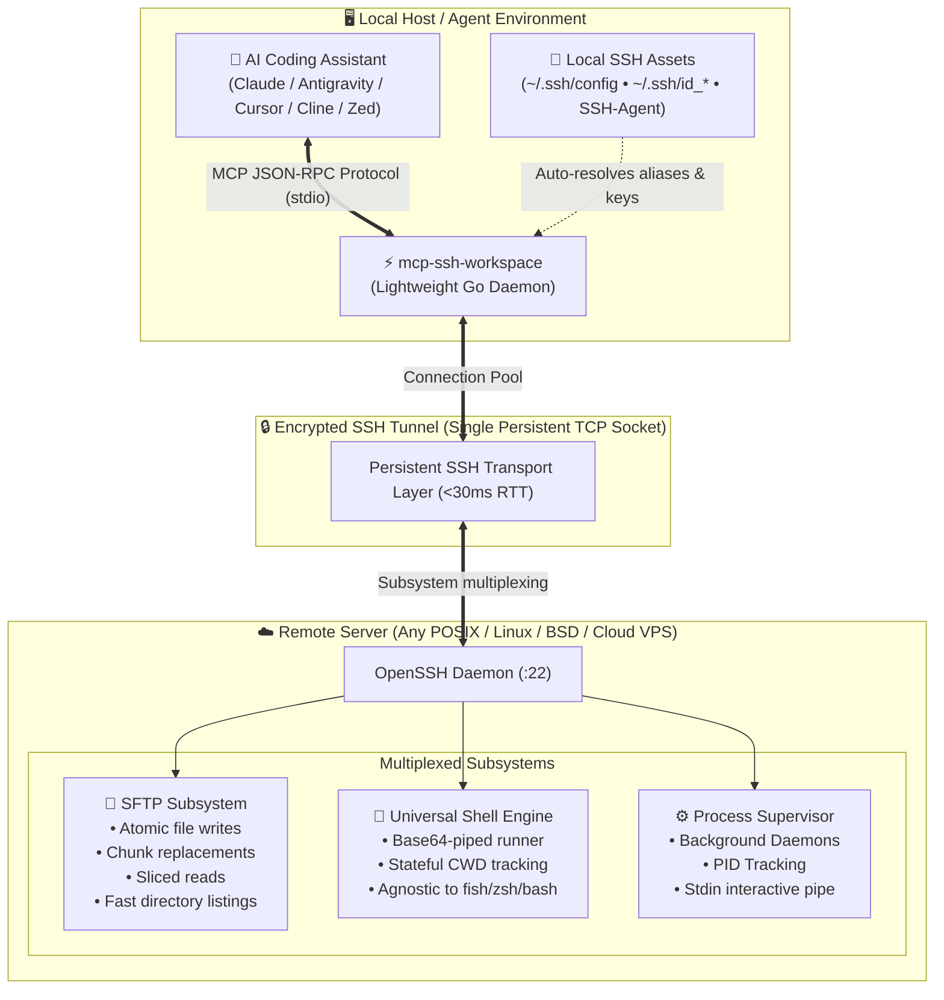

<div align="center">

# ⚡ mcp-ssh-workspace

### *The High-Performance, Native-Like SSH Workspace Engine for Autonomous AI Agents*

[](LICENSE)
[](https://go.dev)
[](flake.nix)
[](https://modelcontextprotocol.io)
[](https://github.com/surtr85/mcp-ssh-workspace)

<p align="center">
  <b>Transform remote servers into local-feeling coding environments for AI coding assistants.</b><br/>
  Persistent sessions • Multiplexed connection pooling • Surgical atomic edits • Token-capped line slicing • Universal shell-agnostic runner
</p>

---

[Key Features](#-why-mcp-ssh-workspace) • [Benchmarks](#-real-world-benchmarks) • [Architecture](#-architecture) • [The 11 Tools](#-the-11-agent-primitives) • [Quickstart](#-quickstart--installation) • [Client Setup](#-mcp-client-configurations) • [NixOS Integration](#-declarative-nixos--home-manager)

---

</div>

## 💡 Why `mcp-ssh-workspace`?

Existing SSH MCP implementations treat remote machines like dumb `ssh exec` targets:
- Every command spawns a fresh shell, **discarding `cd` and environment state**.
- Large files are dumped via `cat`, **instantly blowing LLM context budgets**.
- Edits rely on fragile bash `sed` or `cat << EOF` scripts that **corrupt files on quotes and escapes**.
- Remote login shells like `fish` or `zsh` break naive bash command assumptions.
- Background daemons and web servers **hang the agent indefinitely**.

**`mcp-ssh-workspace` was engineered from scratch in Go to eradicate every single one of these failure modes.**

### 📊 Feature Matrix

| Feature | Generic SSH MCP Solutions | ⚡ `mcp-ssh-workspace` |
| :--- | :--- | :--- |
| **Shell State (`cwd` & env)** | ❌ **Stateless:** Every call opens a new session. `cd /app` is immediately lost. | ✅ **Persistent Session:** Tracks `cwd` and maintains directory context seamlessly across calls. |
| **Network Overhead** | ❌ Re-authenticates & renegotiates SSH crypto on *every single* tool call (~1000ms). | ✅ **Multiplexed Pool:** Single long-lived SSH/SFTP connection (**<30ms** tool round-trip). |
| **File Reading** | ❌ Dumps entire files with `cat` (overflows model context tokens). | ✅ **Token-Capped Slicing:** Exact `StartLine`/`EndLine` ranges, line numbering, and byte caps. |
| **File Editing** | ❌ Fragile `sed` / `echo` scripts that mangle escapes, quotes, and indentation. | ✅ **Surgical Replacement:** Atomic chunk find-and-replace over binary SFTP. |
| **Long-Running Daemons** | ❌ Blocks and times out on dev servers (`npm run dev`, `cargo watch`). | ✅ **Async Task Supervisor:** Detaches into tracked background tasks (`status`, `kill`, `stdin`). |
| **Remote Host Setup** | ❌ Requires Python, Node.js runtime, or server-side agent daemons. | ✅ **Zero Footprint:** Requires only standard OpenSSH and SFTP on the remote host. |
| **Shell Compatibility** | ❌ Assumes standard bash; crashes if user's remote shell is `fish` or `csh`. | ✅ **Universal Shell Engine:** Base64-piped execution immune to remote login shell syntax. |
| **Host Connectivity** | ❌ Hardcoded host at boot; crashes if server is offline or unreachable. | ✅ **Dual Mode:** Static host via flags **OR** dynamic `remote_connect` in-flight. |

---

## ⚡ Real-World Benchmarks

Tested on a live remote host across the public internet (**Void Linux x86_64, Kernel 6.18, Remote Shell: Fish**):

```text
=== 🚀 MCP-SSH-WORKSPACE BENCHMARK SUITE: amadeus@ssh.surtr.ir ===

1. remote_connect:                 138.34 ms  (Initial TCP + SSH Key Auth + SFTP Subsystem)
2. remote_session_info:             51.78 ms  (OS Detection + Current User + CWD)
3. remote_run_command:              45.87 ms  (Multi-command pipeline: uname, free, df)
4. remote_list_dir:                 29.33 ms  (SFTP scan of 32 items with metadata & sizes)
5. remote_write_file:               36.71 ms  (SFTP binary upload with parent directory creation)
6. remote_view_file:                20.34 ms  (Surgical line slice L1-L2 with line formatting)
7. remote_replace_file_content:     39.03 ms  (Atomic chunk replacement via temp swap)
8. remote_run_command (cleanup):    22.15 ms  (File removal and state sync)
```

> **The Takeaway:** Working with a remote server over `mcp-ssh-workspace` feels **virtually indistinguishable from local development**.

---

## 🏗️ Architecture



---

## 🛠️ The 11 Agent Primitives

`mcp-ssh-workspace` exposes 11 surgical tools specifically tailored to LLM reasoning:

### 1. Connection & Session Lifecycle
- **`remote_connect`**: Dynamically connect or switch between remote hosts at runtime. Auto-resolves hosts, ports, identity files, and proxies from `~/.ssh/config`.
- **`remote_disconnect`**: Cleanly terminate active SSH and SFTP channels.
- **`remote_session_info`**: Fetch remote host environment metadata (`/etc/os-release`, `uname -mrs`, active user, and persistent `cwd`).

### 2. Terminal & Process Supervision
- **`remote_run_command`**: Execute bash commands with clean `stdout`/`stderr` separation, exit code capture, and persistent directory retention.
- **`remote_manage_task`**: Manage long-running daemons and dev servers (`action: "list" | "status" | "kill" | "send_input"`).

### 3. Surgical SFTP File Operations
- **`remote_view_file`**: Read files with token-safe line ranges (`StartLine` to `EndLine`), line numbering, and byte budget protections.
- **`remote_replace_file_content`**: Surgically replace an exact code block without rewriting or risking whole-file corruption.
- **`remote_write_file`**: Atomically create or overwrite remote files with automatic recursive directory creation (`mkdir -p`).
- **`remote_list_dir`**: Inspect remote directory listings with exact byte sizes, POSIX permissions, and modification timestamps.

### 4. High-Performance Code Search
- **`remote_grep_search`**: Fast regex search across the remote workspace (automatically uses `rg` if present, fallback to `grep -rn`).
- **`remote_find_by_name`**: Fast file and directory glob finding (automatically uses `fd` if present, fallback to `find`).

---

## 🚀 Quickstart & Installation

### Option 1: Zero-Install via Nix (Recommended)

Run instantly without installing Go or compiler toolchains:

```bash
# Connect using an alias from ~/.ssh/config:
nix run github:surtr85/mcp-ssh-workspace -- --host my-vps

# Or specify user and host directly:
nix run github:surtr85/mcp-ssh-workspace -- --host 192.168.1.50 --user ubuntu

# Or start in Dynamic Mode (let the AI agent connect when needed):
nix run github:surtr85/mcp-ssh-workspace
```

### Option 2: Install via Go

```bash
go install github.com/surtr85/mcp-ssh-workspace/cmd/mcp-ssh-workspace@latest
```

### Option 3: Build from Source

```bash
git clone https://github.com/surtr85/mcp-ssh-workspace.git
cd mcp-ssh-workspace
go build -o mcp-ssh-workspace ./cmd/mcp-ssh-workspace
```

---

## ⚙️ Configuration & Flags

| Flag | Env Variable | Default | Description |
| :--- | :--- | :--- | :--- |
| `--host`, `-H` | `SSH_HOST` | `""` | Remote host, IP, or `~/.ssh/config` alias *(optional on boot)* |
| `--user`, `-u` | `SSH_USER` | Current `$USER` | Remote SSH username |
| `--port`, `-p` | `SSH_PORT` | `22` | Remote SSH port (or auto-resolved from ssh config) |
| `--key`, `-i` | `SSH_KEY` | Auto-detected | Path to private SSH key (`~/.ssh/id_ed25519`, etc.) |
| `--password` | `SSH_PASSWORD` | `""` | SSH password (if not using key authentication) |
| `--workdir`, `-w`| `SSH_WORKDIR` | Remote Home | Initial remote working directory |
| `--agent` | - | `true` | Use local SSH agent (`$SSH_AUTH_SOCK`) |

> 💡 **Dynamic Mode:** If `--host` is omitted at startup, `mcp-ssh-workspace` boots in **Dynamic Mode**, allowing the AI agent to connect to any host on-demand using `remote_connect`.

---

## 🤖 MCP Client Configurations

### Claude Desktop
Add to `~/.config/Claude/claude_desktop_config.json` (Linux) or `~/Library/Application Support/Claude/claude_desktop_config.json` (macOS):

```json
{
  "mcpServers": {
    "ssh-workspace": {
      "command": "nix",
      "args": [
        "run",
        "github:surtr85/mcp-ssh-workspace",
        "--",
        "--host", "my-server-alias"
      ]
    }
  }
}
```

### Google Antigravity
Add to `~/.gemini/config/mcp_config.json`:

```json
{
  "mcpServers": {
    "ssh-workspace": {
      "command": "mcp-ssh-workspace"
    }
  }
}
```

### Cursor / Cline / Zed
Add to your client's MCP configuration settings:

```json
{
  "mcpServers": {
    "ssh-workspace": {
      "command": "mcp-ssh-workspace",
      "args": ["--host", "prod-box", "--workdir", "/var/www/app"]
    }
  }
}
```

---

## ❄️ Declarative NixOS & Home-Manager

Integrate directly into your declarative NixOS Flake configuration:

```nix
# flake.nix
{
  inputs = {
    nixpkgs.url = "github:nixos/nixpkgs/nixos-unstable";
    mcp-ssh-workspace = {
      url = "github:surtr85/mcp-ssh-workspace";
      inputs.nixpkgs.follows = "nixpkgs";
    };
  };

  outputs = { self, nixpkgs, mcp-ssh-workspace, ... }: {
    # In your Home-Manager configuration:
    homeManagerConfiguration = {
      modules = [
        ({ pkgs, ... }: {
          home.packages = [
            mcp-ssh-workspace.packages.${pkgs.system}.default
          ];

          home.file.".gemini/config/mcp_config.json".text = builtins.toJSON {
            mcpServers = {
              ssh-workspace = {
                command = "${mcp-ssh-workspace.packages.${pkgs.system}.default}/bin/mcp-ssh-workspace";
              };
            };
          };
        })
      ];
    };
  };
}
```

---

## 🔒 Security Principles

- **Zero Unencrypted Passwords:** Defaults to public-key cryptography (`Ed25519` / `RSA`) and local SSH Agent forwarding.
- **Surgical Atomic Swapping:** File edits are staged in temporary files and swapped using atomic SFTP renames, completely preventing truncated or corrupted remote files.
- **Context Budget Protection:** Hard bounds on directory listing depths, grep results, and file slice reads prevent denial-of-service against LLM context windows.

---

## 📄 License

MIT License © 2026 [surtr85](https://github.com/surtr85). Distributed under the [MIT License](LICENSE).
